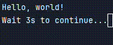

# system-pause

`system-pause` is a Rust library for stopping program execution temporarily. It offers simple macros for pausing the console, either waiting for user input or pausing with a countdown timer. This is useful for debugging or interactive console applications.

## Features

- **Pause with a default message**: Displays a pre-defined message and waits for the user to press "Enter".
- **Pause with a custom message**: Allows you to display a custom message before waiting for "Enter".
- **Pause for a specific time**: Stops execution for a specified duration, with an optional countdown message.

---

## Installation

Add `system-pause` to your `Cargo.toml` as follows:

```toml
[dependencies]
system-pause = "0.1.2" # Or what ever the latest version is.
```

or install via github
```toml
[dependencies]
system-pause = {git="https://github.com/Drew-Chase/system-pause.git"}
```

Then, include it in your Rust code using:

```rust
use system_pause::{pause, pause_for_time};
```

---

## API Documentation

### 1. `pause!()`

Pauses the program and displays a default message: `"Press Enter to continue..."`.

#### Example:

```rust
use system_pause::pause;

fn main() {
    println!("Pausing...");
    pause!(); // Waits for user to press Enter
    println!("Continuing...");
    
}
```

Console output
```text
> Pausing...
> Press Enter to continue...
 
> Continuing...
```

You can also specify a custom message:

```rust
use system_pause::pause;

fn main() {
    println!("Custom pause!");
    pause!("Please press Enter to proceed..."); // Custom message
    println!("Resumed.");
}
```

Console output
```text
> Custom pause!
> Please press Enter to proceed...
 
> Resumed.
```

---

### 2. `pause_for_time!(<seconds>)`

Pauses the program for a given number of seconds and provides a real-time countdown on the console.

**Note**: This macro blocks the current thread while waiting. Use this carefully in applications that require thread responsiveness or real-time performance.

#### Example:

```rust
use system_pause::pause_for_time;

fn main() {
    println!("Timer pause!");
    pause_for_time!(5, "This line should be cleared after {} seconds."); // Pauses for 5 seconds
    println!("5 seconds have passed.");
}
```

Console output   


---

## Examples

**Basic Example**:

```rust
use system_pause::pause;

fn main() {
    println!("Hello, world!");
    pause!();
    println!("Goodbye, world!");
}
```

**Custom Message Example**:

```rust
use system_pause::pause;

fn main() {
    println!("Hello, world!");
    pause!("Please press Enter to continue...");
    println!("Goodbye, world!");
}
```

**Timer-based Pause Example**:

```rust
use system_pause::pause_for_time;

fn main() {
    println!("Hello, world!");
    pause_for_time!(3); // Pauses for 3 seconds with a countdown
    println!("Goodbye, world!");
}
```
For more information please see the [examples](/examples) directory

---

## Notes and Limitations

- **Thread Blocking with Timers**: When using the `pause_for_time!` macro, note that it blocks the current thread while waiting. This may cause performance issues in applications running multiple threads or handling time-sensitive tasks.

---

## License

This project is licensed under the GPL-3.0 License. See the [LICENSE](LICENSE) file for details.